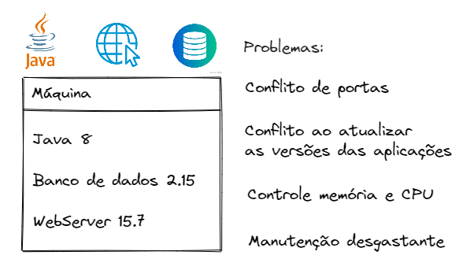
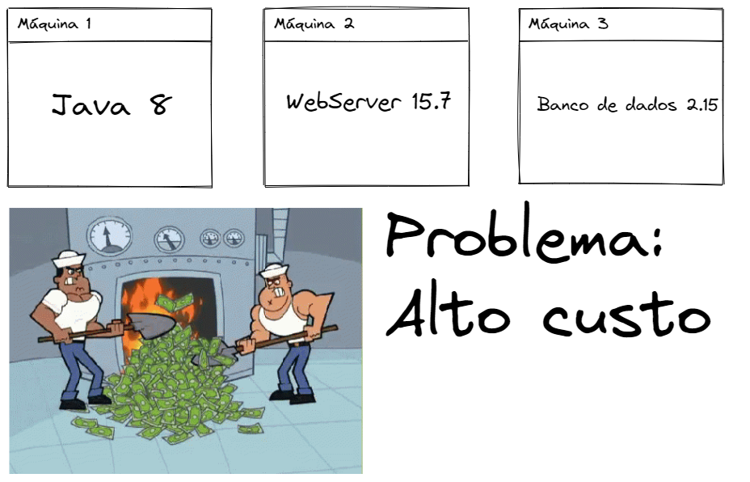
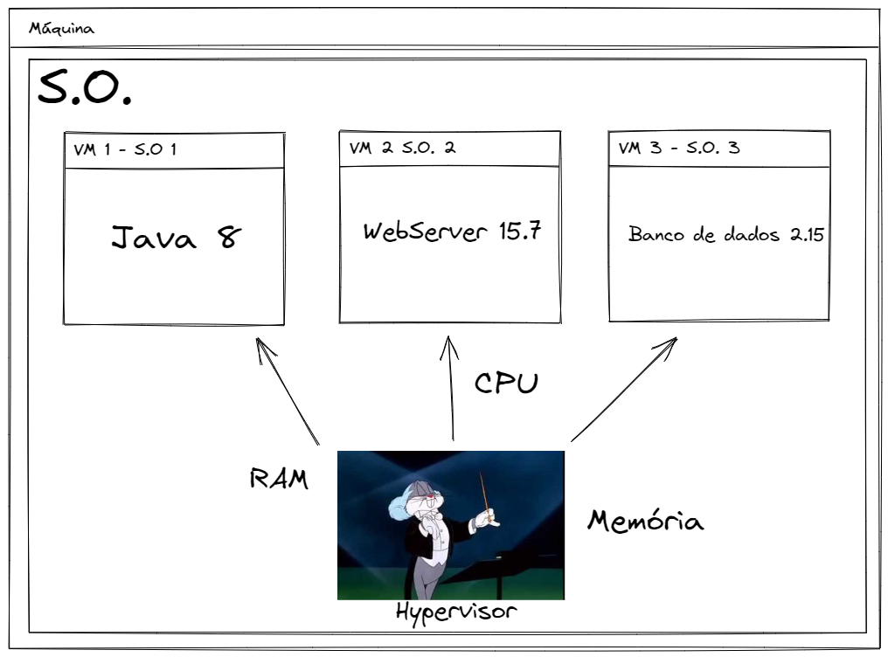
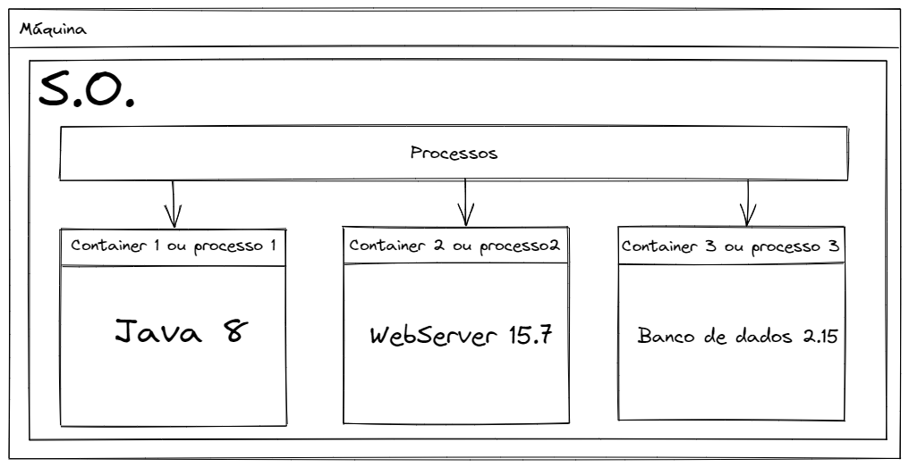

# Docker for dummies

## Objetivo

Esse repositório tem como objetivo apresentar a qualquer um, de forma simples e direta, o que é o Docker.
Mostrando, não só o que é, mas o que fez surgir.

#### O que veremos:
- Saber o que é o Docker e pra que serve
- Instalação do Docker no Windows
- Baixar uma imagem - Docker Hub
- Executar um container
- Executar aplicação em um container
- Tudo em Todo o Lugar ao Mesmo Tempo - Docker Compose

---

## Por que o Docker foi criado?

Qual é o problema que ele está solucionando?

### Situação: Integração entre várias aplicações em um único computador
Supondo que você tenha uma aplicação Java na versão 8, com um banco de dados qualquer na versão 2.15 e um WebServer qualquer na versão 15.7. Qual a chance de dar ruim ao fazer qualquer manutenção? MUITA! Isso deixa muitas lacunas que podem quebrar seu sistema.

### problemas:
* Conflito de portas entre as aplicações
* Nova veresão da aplicação não funciona no S.O da máquina
* Controle de memória e CPU descontrolados
* Manutenção é pesada e desgastante

O que poderiamos fazer para solucionar isso?

### Solução 1: Comprar uma máquina para cada aplicação

**Problema:** É preciso de muito dinheiro para manter as máquinas em funcionamento! 
A AWS iria amar!!!

### Solução 2: Uma ÚNICA máquina com VÁRIAS VMs e cada VM com seu Sistema Operacional e dependências necessárias.

Fazendo dessa forma, solucionamos o problema de custos na solução anterior, pois temos uma única máquina com todas as aplicações e separado cada uma em sua VM.

Nessa máquina, com um Sistema Operacional, criariámos várias VMs com um S.O para cada configurado exclusivamente para cada aplicação. Dessa forma isolamos as partes necessárias de nosso sistema e deixariamos o controle de RAM, CPU e Memória com o Hypervisor.

### Mas a questão é... precisa de tudo isso?
* Precisamos de uma VM com um S.O próprio para cada aplicação?
* O Hyperviso precisa mesmo ficar gerenciando RAM, CPU e Memória para cada VM?

### Solução 3: Utilizar Containers ou processos
Se o SO já faz esse trabalho de gerenciamento de processos, por que não deixar ele gerenciar os Containers?

É justamente isso que o Docker trás!
Utiliza o S.O principal da máquina para gerir os containers como apenas mais um processo, economizamos espaço de armazenamento, RAM e CPU.

